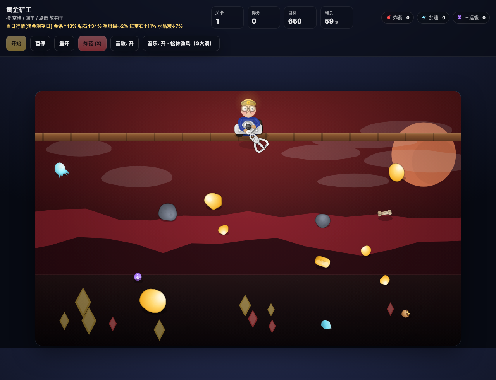

# 黄金矿工（HTML5 Canvas）

一个可离线运行的「黄金矿工」玩法原型：钩子摆动 → 放钩子 → 抓取物品 → 拉回计分 → 倒计时结束结算过关/失败。

## 运行方式

- 双击 `run.command` 一键启动本地服务器并打开游戏（macOS）。
- 或在终端启动（macOS/Linux）：`./start.sh`
- 或手动启动本地服务器：
  - `python3 -m http.server 5173 --bind 127.0.0.1`
  - 然后打开 `http://127.0.0.1:5173/`

说明：当前入口使用 ES module（`src/main.js`），建议通过本地服务器运行。直接双击 `index.html` 在部分浏览器会因为 `file://` module 限制而无法加载。

## 操作

- 空格 / 点击画面：放钩子
- 进入游戏会先选择单人/双人；双人模式下玩家2：回车(Enter) 放钩子
- P：暂停/继续
- X：使用炸药（抓到物品时）
- M：开关音乐
- S：开关音效
- N：切换下一首音乐

## 打包为 macOS 应用（仅 macOS）

项目已内置一个 WebView 壳（`macos/GoldMinerApp.swift`），可一键生成 `.app`（可选 `.dmg`）。

- 生成 `.app`：`./macos/build.command`
- 生成 `.zip`：`./macos/build.command --zip`
- 生成 `.dmg`：`./macos/build.command --dmg`

输出目录：`dist/macos/`

说明：
- 默认是**未签名**应用，分发到其他 Mac 可能会被 Gatekeeper 拦截；可在 Finder 里右键 App → 打开。
- 如需正式分发（避免拦截），需要使用 Developer ID 证书进行 `codesign` 并 `notarytool` 公证。

## 验证

- 单元测试与语法检查：`npm run verify`
- macOS 打包检查：`./macos/build.command`
- 浏览器冒烟清单：[docs/testing/browser-smoke.md](docs/testing/browser-smoke.md)

## 机制补充

- 过关后进入商店，用当前分数购买道具，再进入下一关。
- 支持固定随机种子：在地址后加 `?seed=12345` 可复现布局。
- 难度为阶段性 + 自适应：会根据玩家上一关的得分超出目标多少，智能调整下一关目标/时间/物品组成。
- 第 4 关起，每关会随机一个物品价值倍率（50%~80%），并对该关所有物品价值四舍五入生效。
- 内置 10 首舒缓纯音乐，关卡会按种子自动选择（可用 N 手动切换）。
- 新增多种物品（如金条/宝石/水晶/化石等）；其中炸药桶为危险物：抓到有概率爆炸，且爆炸会清除范围内物品。
- 第 5 关起会出现小老鼠：会水平折返移动，且有概率背着钻石/金条。

## 可扩展方向（下一步）

- 商店与道具：炸药/加速/幸运袋（已实现）
- 关卡配置：固定关卡数据/随机种子（已实现，可通过 `?seed=12345` 固定）
- 美术与音效：精灵图、粒子特效、音效资源
